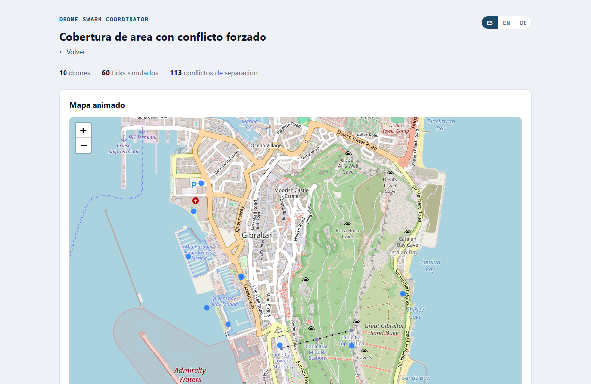

# Drone Swarm Coordinator

[English](README.en.md) · **Español**

[](https://github.com/alberto-navas/drone-swarm-coordinator/actions/workflows/tests.yml)
[](LICENSE)

Reparto de misión, formación y evitación de colisiones para un enjambre de
drones propios — simulado y visualizado sobre un mapa real, con métodos
explicables en cada paso, nada de aprendizaje automático de caja negra.

<p align="center">
  
</p>

*Panel web (`python -m src.web`) — diez drones cubriendo una zona portuaria
en el area del Estrecho de Gibraltar, mapa Leaflet real con reproduccion
animada, no una captura estatica.*

## Motivación

Coordinar un enjambre de drones propios para cumplir una misión — cubrir
una zona, vigilar varios puntos, llegar a varios destinos — es un
problema de asignación y de control distribuido: qué dron hace qué, cómo
evitar que se acerquen demasiado entre sí mientras vuelan a la vez, y
cómo mantener una formación cuando hace falta. Es la otra cara de la
moneda respecto al proyecto hermano
[C-UAS Threat Triage](https://github.com/alberto-navas/cuas-threat-triage):
allí el objetivo es decidir a qué amenaza ajena responder primero; aquí
es coordinar tu propia flota para que cumpla su misión sin chocar. Este
proyecto resuelve las tres piezas con métodos explicables — asignación
voraz, geometría de formación, una regla de separación reactiva — sobre
un simulador propio, y lo visualiza en un panel web con mapa animado real
(mismo enfoque que
[Maritime Domain Awareness](https://github.com/alberto-navas/maritime-domain-awareness)).

## Capacidades

Cuatro módulos independientes y auditables por separado, `src/`:

- **Reparto de misión** (`allocation.py`): para tareas de punto/destino,
  un emparejamiento voraz por distancia — de todos los pares (dron libre,
  tarea sin asignar) posibles, se elige repetidamente el más cercano
  todavía disponible. Deliberadamente no óptimo (sin algoritmo húngaro),
  mismo compromiso de simplicidad/explicabilidad que el asociador
  vecino-más-cercano del tracker de C-UAS Threat Triage. Para cobertura
  de área, el rectángulo de la zona se divide en tantas celdas como
  drones haya (rejilla lo más cuadrada posible), cada celda se asigna por
  el mismo emparejamiento voraz, y cada dron recibe una ruta de barrido
  "cortacésped" (boustrophedon) que cubre su celda por completo.
- **Formación** (`formation.py`): tres formas — línea, V, rejilla —
  relativas a un líder designado o al centroide del grupo (con su rumbo
  medio calculado por media circular, no aritmética). El hueco de cada
  dron se asigna reutilizando el mismo emparejamiento voraz de
  `allocation.py`, para no duplicar la lógica de "quién va a dónde".
- **Conflictos de separación** (`conflict.py`): detección — distancia
  entre cada par de drones en cada paso de simulación contra un umbral
  mínimo de seguridad — y corrección reactiva — un vector de repulsión
  tipo *separation steering* (Reynolds, 1987) que se suma al vector de
  avance hacia la tarea o el hueco de formación. No es un optimizador de
  trayectorias ni ofrece garantía matemática de evitar colisiones (ver
  "Limitaciones conocidas" más abajo); es una regla reactiva simple,
  documentada como tal.
- **Simulación** (`simulation.py`): bucle de pasos discretos (ticks, 1
  tick = 1 segundo de misión) que ata los tres módulos anteriores sobre
  una cinemática mínima (velocidad de crucero constante hacia el punto
  objetivo) y un drenaje simple de batería.

**Panel web** (`src/web/`, opcional): define tu propia misión — número de
drones, punto de despegue, y una tarea (cubrir área / vigilar puntos /
llegar a destinos) o una formación — o elige uno de los dos escenarios de
demostración, y ve un mapa animado (Leaflet real, con calles y costas
reales) con la trayectoria de cada dron y los conflictos de separación
marcados en su instante exacto, junto a la tabla de estado final de la
flota y la tabla de conflictos agrupados por pareja de drones. Una misión
personalizada usa tarea O formación, nunca ambas a la vez — combinarlas
dejaría la tarea sin ningún efecto (la formación recalcula el objetivo de
cada dron en cada tick), así que el formulario obliga a elegir un único
modo en vez de ofrecer una combinación silenciosamente rota. Capa fina
sobre el mismo `src/simulation.py` que usa el CLI: no reimplementa nada
del motor.

**Español / English / Deutsch**: el CLI (`--lang`) y el panel web
(selector de idioma en la página) muestran toda la interfaz — estados de
dron, cabeceras, nombres de escenario — en cualquiera de los tres
idiomas. `src/i18n.py` es el único módulo que sabe que existe el concepto
de idioma; el motor de simulación (`allocation.py`, `formation.py`,
`conflict.py`, `simulation.py`) nunca lo importa.

## Arquitectura

```
Escenario (src/scenarios.py)
  -> Drone[] + Mission (tareas + formacion opcional)
        │
        ▼
src/simulation.py  build_initial_state()
  └── src/allocation.py   (reparto de tareas, una unica vez al arrancar)
        │
        ▼
src/simulation.py  step()  — se repite un tick por segundo de mision
  ├── src/formation.py    (hueco de formacion, si la mision lo pide;
  │                         se recalcula cada tick porque el origen se mueve)
  ├── src/conflict.py     (deteccion + correccion de separacion)
  └── src/geo.py          (distancias, offsets locales, rumbos)
        │
        ▼
SimulationState[]  (historial completo de la simulacion)
        │
        ├──────────────────────────────┬─────────────────────
        ▼                              ▼
src/cli.py                     src/web/app.py (FastAPI)
  (informe de texto,             ├── animated_map.py (Leaflet + TimestampedGeoJson)
   --lang es/en/de)              └── agrupa conflictos por pareja para la tabla
```

`src/model.py` es el vocabulario común (`Drone`, `Task`, `Mission`,
`SimulationState`, `ConflictEvent`) que usan todos los módulos: el motor
de asignación no sabe cómo se construyó un escenario, y el panel web no
reimplementa ninguna regla de reparto o de formación.

`src/geo.py` resuelve la geometría de corta escala (separación entre
drones, offsets de formación) con una aproximación de plano tangente
local, no una proyección geodésica completa — válida a la escala de
operación de un enjambre (formaciones y separaciones de decenas/cientos
de metros), documentada como tal, no pensada para desplazamientos largos
donde la curvatura terrestre importe.

## Uso

```bash
# Ejecuta un escenario de demostracion y muestra el estado final de la flota
python -m src.cli cobertura
python -m src.cli formacion --ticks 45 --lang en

# Separacion minima de seguridad personalizada (por defecto: 15 m)
python -m src.cli cobertura --min-separation 20
```

**Panel web**:

```bash
python -m src.web
# -> http://127.0.0.1:8000
```

En "Construye tu propia misión", define el número de drones, el punto de
despegue, y el tipo de misión (área a cubrir, puntos a vigilar, destinos,
o formación) con sus parámetros; o, más abajo, elige uno de los dos
escenarios de demostración y una duración en ticks. Pulsa "Ejecutar" para
ver el mapa animado, el estado final de la flota y los conflictos de
separación detectados. El selector ES/EN/DE arriba a la derecha cambia el
idioma de toda la página — la URL (`?lang=en`) es autocontenida, sin
cookies ni estado de sesión, y al cambiar de idioma en un informe se
vuelve a ejecutar la misma misión o el mismo escenario con los mismos
parámetros.

## Escenarios de demostración

100% sintéticos, generados por `src/scenarios.py` de forma determinista
(sin números aleatorios): no existe un dataset público de vuelos de
enjambre real con el detalle que hace falta aquí (posición + tarea +
estado de cada dron en cada instante), y así se puede controlar
exactamente qué casos se demuestran. Ambos se plantean en la zona del
Estrecho de Gibraltar/Alborán — la misma región que usa la demo de
Maritime Domain Awareness — porque una instalación portuaria real es un
objetivo de vigilancia/cobertura de área verosímil para este tipo de
flota:

- **Cobertura con conflicto forzado** (`cobertura`): diez drones despegan
  todos juntos desde el mismo punto de una instalación portuaria para
  cubrir por completo una zona rectangular a su alrededor. Al arrancar
  todos en la misma posición, los primeros ticks generan conflictos de
  separación reales que la corrección reactiva tiene que resolver
  mientras cada dron se dirige a la celda que le ha tocado.
- **Tránsito en formación** (`formacion`): diez drones arrancan ya
  razonablemente separados y forman una cuna en V para transitar juntos,
  para demostrar una formación limpia sin el ruido de una corrección de
  colisiones arrancando de cero.

## Tests

```bash
pytest -v
```

93 tests cubriendo los nueve módulos del motor y del panel web (modelo,
geometría, asignación, formación, conflictos, simulación, escenarios,
i18n, CLI, mapa animado, panel web), 99% de cobertura (`pytest --cov=src`,
con un umbral de CI del 85% como red de seguridad, no como objetivo línea
a línea a perseguir). Se ejecutan automáticamente en cada `push` vía
GitHub Actions (`.github/workflows/tests.yml`), en Ubuntu y Windows.

## Calidad de código

```bash
ruff check .        # lint
ruff format .       # formato
mypy src/           # comprobacion estatica de tipos
```

Configurado en `pyproject.toml`. Comprobado automáticamente en cada
`push` (job `lint` separado del de tests).

## Limitaciones conocidas

- El reparto de tareas es voraz, no óptimo globalmente (sin algoritmo
  húngaro): un dron puede acabar con una tarea que no es la más cercana
  a él en particular, si esa ya se la llevó otro dron aún más cercano en
  una iteración anterior. Limitación deliberada, documentada en
  `allocation.py`.
- La corrección de colisiones es una regla reactiva simple, no una
  garantía matemática. Se descubrió durante la verificación visual del
  panel: en el escenario de cobertura, dos drones lanzados desde el mismo
  punto hacia celdas vecinas con rumbos casi paralelos se estabilizan en
  un equilibrio unos metros por debajo del umbral de seguridad en vez de
  separarse del todo — la fuerza de separación y la de avance hacia la
  tarea se compensan en vez de que una gane a la otra. El sistema lo
  detecta y lo reporta correctamente durante toda la simulación (por eso
  el escenario se llama "con conflicto forzado"), pero no lo resuelve por
  completo; es el comportamiento esperado de una regla simple, no un
  fallo del detector. La tabla de conflictos del panel agrupa estos casos
  por pareja de drones (desde/hasta qué tick, cuántas veces, distancia
  mínima) para que se lean como lo que son — un conflicto sostenido, no
  cientos de eventos sueltos.
- Geometría en 2D (latitud/longitud); la altitud es un campo de estado
  sin efecto todavía en la separación ni en la geometría de formación.

## Qué NO hace este proyecto (deliberadamente)

Esto es una herramienta de **simulación, planificación y visualización**
de una flota propia para una misión legítima (vigilancia, cobertura de
área, logística) — a diferencia del proyecto hermano de intercepción no
letal, esto no trata sobre armas ni sobre neutralizar nada:

- **No controla drones reales ni se conecta a ningún hardware de
  vuelo** — ni autopiloto (MAVLink, ArduPilot, PX4), ni SDK de fabricante,
  ni radio. Todo el estado que se ve (posición, batería, tarea) lo genera
  el simulador, no un dron físico.
- **No es un sistema de mando y control certificado**: no cumple, ni
  pretende cumplir, ninguna normativa de aviación no tripulada. Usar este
  código para operar drones reales sin las pruebas, certificaciones y
  autorizaciones que exige la ley sería irresponsable y, en la mayoría de
  jurisdicciones, ilegal.
- **No hay percepción real**: cada dron "sabe" su posición exacta porque
  el simulador se la da, no porque la perciba con sensores propios. No
  hay cámaras, ni detección de obstáculos, ni evasión de nada que no sea
  otro dron del propio enjambre.
- **No es una herramienta de vigilancia sobre terceros**: las tareas son
  puntos, áreas y formaciones abstractas definidas por quien opera el
  simulador, sin ningún componente de reconocimiento o identificación de
  personas u objetos reales.
- El reparto de tareas y la evitación de colisiones son heurísticas
  simples y deliberadamente explicables — ver "Limitaciones conocidas"
  arriba para lo que eso implica en la práctica.

## Posibles extensiones

- **Reparto globalmente óptimo** (algoritmo húngaro) como alternativa
  documentada al emparejamiento voraz actual, para comparar la distancia
  total recorrida por el enjambre entre ambos métodos.
- **Altitud/3D** en la separación y en la geometría de formación (hoy
  puramente 2D).
- **Misiones con tareas mixtas** (área + puntos + destinos a la vez) —
  hoy cada escenario usa un único tipo de tarea, aunque el modelo de
  datos no lo prohíbe.
- **Más formaciones** (escalón, diamante) reutilizando el mismo
  mecanismo de huecos de `formation.py`.
- **Despliegue en vivo del panel web** (como los proyectos hermanos, vía
  Render): de momento solo está pensado para correr en local
  (`python -m src.web`).
